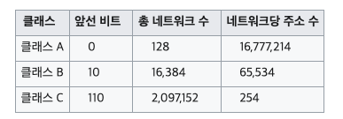

## IP 주소 체계

IP : 인터넷에 연결된 컴퓨터(호스트)의 논리적 주소

- IPv4 : 주소 길이 32bit / 8비트씩 4자리 / 각 자리는 . 으로 구분 
  Network ID + HOST ID로 이루어짐

- IPv6 : 주소 길이 128bit / 16비트씩 8자리 / 각 자리는 : 으로 구분
  Network 주소 + 인터페이스 주소로 이루어짐

IPv4 의 총 주소길이가 32bit라서 2^32 (약 4억)개로 할당할 수 있는 호스트의 개수가 제한되는 문제가 있었다. 그리고 낭비되는 주소가 많다는 단점도 있었다.
그래서 주소를 더 많이 생성할 수 있는 IPv6가 등장했지만, (물리적인 확장)

- 서브넷
- DHCP
- NAT

등의 논리적인 확장 방안으로 주소 부족문제를 해결할 수 있기에 아직까지는 IPv4 가 대세이다.

### 클래스 기반 할당 방식 (CIDR)

초기의 IP주소 체계는 2^32 개의 IP 를 효율적으로 할당하기 위해 다섯개의 서로 다른 특성을 가진 클래스로 구분해두고 상황에 맞게 할당하였다.

- 클래스 A ~ 클래스 C : **네트워크 주소** + **호스트 주소** 
  일대일 통신에 사용됨
- 클래스 D : **브로드캐스트용 주소** 
  멀티캐스트에 사용됨
- 클래스 E : 예비용 주소 
  예비용

네트워크 주소에 대해서 호스트 주소를 할당할 때, 첫번째와 마지막은 미리 할당되어 있어서 사용할 수 없다. 첫번째 주소는 네트워크 구별주소, 마지막 주소는 브로드캐스트용이다.

### DHCP (Dynamic Host Configuration Protocol)

라우터와 게이트 장비에서 호스트에 새로운 IP 주소를 자동으로 할당하는 관리 프로토콜

인터넷에 접속할 때마다 호스트는 DHCP 서버에 새로운 IP 주소 임대를 주기적으로 요청. 호스트의 IP는 지속적으로 변경되는 유동 IP가 된다.

유동IP는 고정 IP보다 보안적인 장점이 있다.

### NAT (Network Address Translation)

사설 IP주소를 공인 IP주소로 매핑하는 기능. 이를 가능하게 하는 소프트웨어(ICS, RRAS, Netfilter)들이 있다.

여러개의 사설 IP들은 독립적인 IP를 가지면서도 외부 인터넷 망에는 동일한 공인 IP로 접속하게 된다.

외부에서 개별적인 사설 IP로 접근할 수 없는 방화벽 역할을 한다. L3 스위치에 해당하는 공유기에 NAT기능이 탑재되어 있다.

물론 연결되는 호스트의 개수가 많아지면 인터넷 접속 속도는 느려질 수 있다.

### Subnetting

IP주소를 효율적으로 나누어 사용하기 위해 IP 호스트 ID영역을 다시 나누어 IP를 새로 마스킹

특정 네트워크에 IP주소 할당이 필요한 호스트의 개수 n개가 있을 때,
이 네트워크에 부여해야 할 고정 IP의 호스트 ID 크기(size)를 n보다 작아지기 전까지만 계속 반으로 나누고(while size >= n) 최종 size로 나누어진 주소 영역 중 한 부분을 이 네트워크에 할당한다.

할당되지 않은 남는 주소는 다른 네트워크에서 사용할 수 있도록 한다.

---

#### 참고링크

[IPv6의 주소체계](https://xn--3e0bx5euxnjje69i70af08bea817g.xn--3e0b707e/jsp/resources/vsix/addressSystem.jsp)

[네트워크 클래스](https://ko.wikipedia.org/wiki/%EB%84%A4%ED%8A%B8%EC%9B%8C%ED%81%AC_%ED%81%B4%EB%9E%98%EC%8A%A4)

[네트워크 구축 및 운용](https://www.youtube.com/watch?v=-iMFsDdfoeI)
