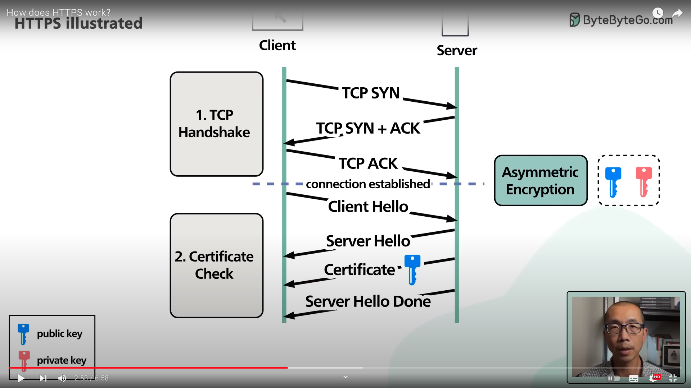

## HTTPS

HTTPS는 HTTP 통신을 암호화하는 것을 말한다. CA (Certivicate Authorities) 에서 발급한 인증서를 구매하거나, 서버 앞단에 HTTPS 를 제공하는 로드밸런서를 두거나, 서버 앞단에 HTTPS를 제공하는 CDN 네트워크를 둠으로써 구축할 수 있다.

HTTP/2 부터는 애플리케이션 계층과 전송계층 사이에 TLS라는 신뢰 계층이 추가되므로 HTTP 요청 및 응답이 암호화된다. 
TLS는 SSL 1.0 부터 시작해서 버전이 올라가면서 명칭이 변경된 계층이다. 최신 TLS 버전은 1.3.

### SSL (secure socket layer) / TLS (transport layer security protocol)

전송계층에서 보안을 제공하는 프로토콜.  
전송계층에서 TCP 핸드셰이크가 이루어진 다음에 TLS 핸드셰이크를 통해 보안세션을 생성한다 
보안 세션을 만들 때는 인증 매커니즘, 키 교환 암호화 알고리즘, 해싱 알고리즘이 사용된다. 

#### TLS 핸드셰이크

- [C->S] Client Hello
- [S->C] Server Hello Start
- [S->C] 인증서 전송 (Public Key 포함)
- [S->C] Server Hello Done
- [C->S] 클라이언트 키 교환 (서버에서 받은 Public Key로 디크립트할 수 있는 클라이언트 키를 생성하여 서버에 전송)
- [C->S] cipher spec 변경 : 보안 모드로 변경 요청
- [C->S] Finished : 클라이언트 보안 모드 준비 완료
- [S->C] cipher spec 변경 : 보안 모드로 변경 요청
- [S->C] Finished : 서버 보안 모드 준비 완료. TLS 핸드셰이크 완료.
- [C->S] 보안 세션 안에서 데이터 전송 시작

### 사이퍼 슈트

TLS 핸드셰이크 단계에서 클라이언트와 서버에 의해 결정되는 암호화 규칙.
클라이언트엣어 사이퍼 슈트를 서버에 전달하면 서버는 해당 사이퍼 슈트 알고리즘 리스트를 제공할 수 있는지 확인한다. 제공할 수 있다면 해당 규칙에 따라 인증 매커니즘이 시작된다.

[예시](https://docs.microsoft.com/en-us/windows/win32/secauthn/cipher-suites-in-schannel)

`TLS_ECDHE_ECDSA_WITH_AES_256_GCM_SHA384_P384` 의 경우

- 신뢰 계층 프로토콜 : TLS
- 키 교환 알고리즘 : ECDHE
- 인증 알고리즘 : ECDSA
- 대칭 암호 알고리즘 : AES
- 암호 키 길이 : 256비트
- 블록 암호 운용 모드 : GCM
- 해시 알고리즘 :SHA_384
- 타원 곡선 암호: P384

이중 AES_256_GCM 부분을 묶어서 AEAD 알고리즘으로 부른다. 256비트 길이의 키를 사용하는 AES 암호화 기술과 GCM 알고리즘이 결합된 알고리즘을 사용한다는 뜻이 된다.

### 해싱 알고리즘

해싱 알고리즘은 해시함수를 이용해 데이터를 더 작고 섞여있는 조각으로 만드는 알고리즘이다.

해시함수란 임의의 길이의 데이터를 고정된 길이의 데이터로 매핑하는 함수이다. (아무리 긴 인풋도 정해진 길이의 아웃풋으로 변환됨) 해시 함수에 의해 얻어지는 아웃풋은 해시 값, 해시 코드, 해시 체크섬 또는 간단하게 해시라고 한다.

SHA-256 해싱 알고리즘에서는 해시 함수의 결괏값이 256비트이다. 해시 함수를 통해 나온 아웃풋은 보통 인풋에 비해 훨씬 더 짧아지며, 아웃풋을 가지고는 원래의 인풋을 추정하기 불가능하다.

### SEO

구글은 공식적으로 HTTPS 서비스를 하는 사이트의 SEO 순위를 높게 만든다.

그 외에도 기본적인 SEO 관리 방법에는 캐노니컬(대표 URL) 지정, 페이지 속도 개선, 사이트맵(페이지목록) 의 연결성과 최신 업데이트된 내용 관리 등이 있다.

---

#### 참고링크

https://www.youtube.com/watch?v=67kItGjvRs0

https://docs.microsoft.com/en-us/windows/win32/secauthn/cipher-suites-in-schannel
