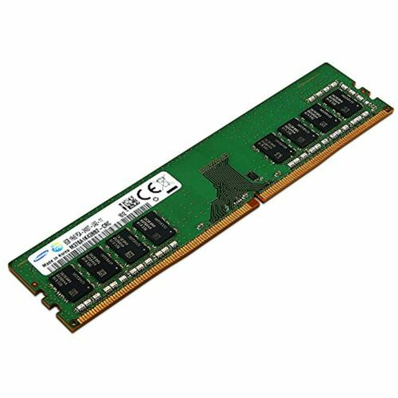
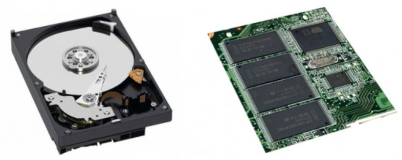

## 컴퓨터의 구성요소 (장치)

- CPU
- DMA 컨트롤러
- 메모리
- 타이머
- 디바이스 컨트롤러

1. CPU

운영체제가 커널을 통해 생성한 프로세스를 처리. 

    * 제어장치
    * 레지스터
    * 산술논리연산장치(ALU)

\* 프로세스 : 실행중인 프로그램, 메모리 상에 올라가 있는 프로그램, CPU가 스케줄링하는 작업대상

### CPU의 연산처리

제어장치가 연산할 값을 메모리와 레지스터에 로드 -> 산술 논리연산장치에 레지스터에 있는 값을 연산할 것을 명령 -> 연산된 값을 메모리로 저장

### 인터럽트

CPU를 잠깐 정지시키는 것.

- IO디바이스로 인한 인터럽트
- 연산 익셉션으로 인한 인터럽트
- 프로세스 오류로 인한 인터럽트

### 인터럽트의 종류

- 하드웨어 인터럽트 : I/O 디바이스 연결
- 소프트웨어 인터럽트(트랩) : 익셉션, 프로세스 오류

2. DMA 컨트롤러

I/O 디바이스가 메모리에 직접 접근할 수 있도록 하는 하드웨어 기기. CPU부하를 막아주는 역할을 하며, CPU의 명령을 받아 태스크를 수행하고 처리결과를 리턴한다.

3. 주 기억장치 / RAM, ROM

CPU에서 처리할 데이터들을 담아두는 저장장치. 메모리가 클 수록 많은 일을 빠르게 처리할 수 있다.
- RAM : 휘발성 메모리.

- ROM : 읽기 전용 영구저장 메모리.

4. 보조 기억 장치 (HDD / SSD)

비휘발성 메모리. 반영구 메모리.
RAM에서 데이터를 꺼내가는 저장장치
읽기/쓰기가 느림.

5. 타이머

프로그램 처리시간에 제한을 거는 장치

6. 디바이스 컨트롤러

컴퓨터와 연결된 I/O 디바이스의 작은 CPU. 장치를 위한 드라이버를 컴퓨터에 설치하면, 드라이버의 코드를 디바이스 컨트롤러가 인식해서 장치를 제어한다.
