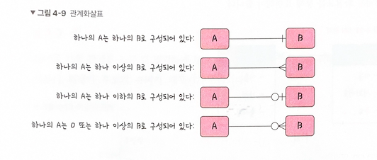

## 테이블 간의 관계 정의

### 관계 화살표

### 1대1 관계

- 테이블 하나를 두 개로 나누어 테이블 구조를 이해하기 쉽게 만들어준다
- 유저 테이블과 해당 유저의 연락처 테이블

### 1대N 관계

- 한 개체(테이블)가 다른 개체(테이블) 여러개를 갖는 관계이다
- 유저 테이블과 해당 유저가 쇼핑한 아이템들의 테이블

### N대M 관계

- A 개체가 B 개체 여러 개를 가질 수 있고, 동시에 B 개체도 A 개체 여러 개를 가질 수 있는 관계
- 학생 테이블과 강의 테이블
- N:M 관계는 1:N, 1:M 두 관계로 분리하여 구축한다
